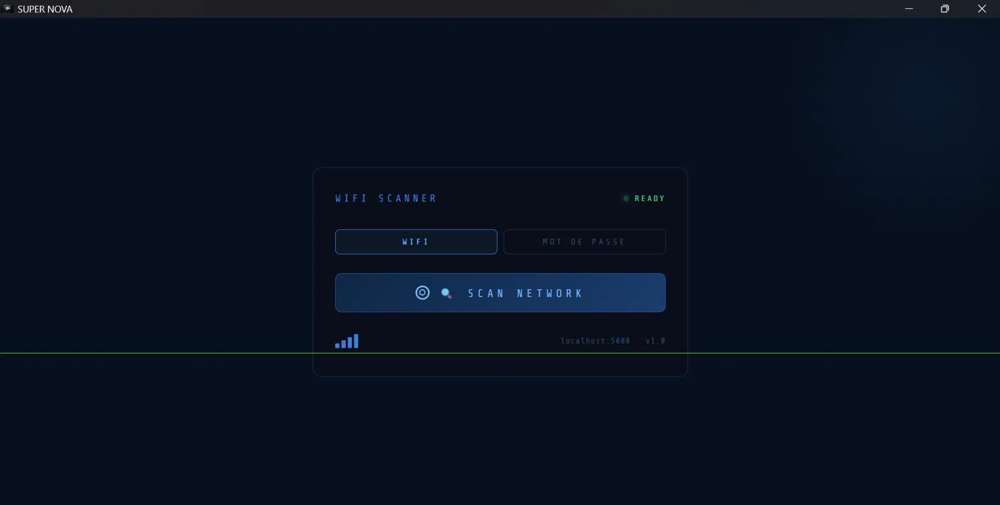
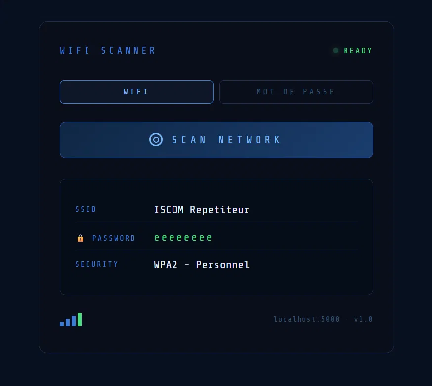
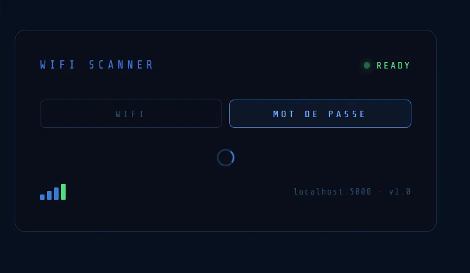
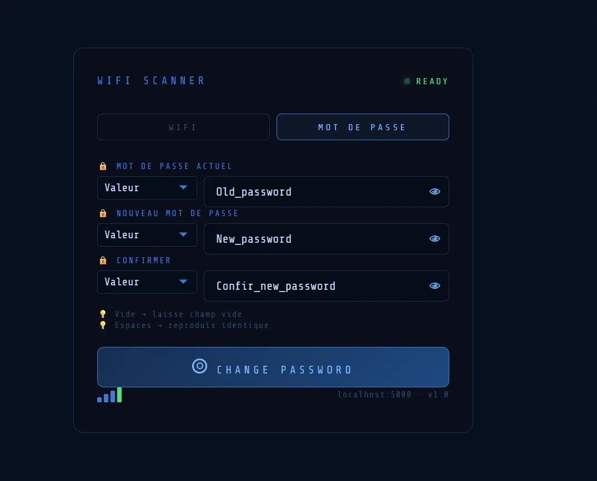

# SUPER NOVA

WiFi Scanner & Windows Password Manager — Application Windows locale, sécurisée, hors ligne.

---

## 📋 Description

SUPER NOVA affiche votre SSID WiFi, mot de passe et type de sécurité.
Change votre mot de passe Windows depuis une interface unique.
Zéro cloud. Zéro telemetry. Local uniquement.

---

## 🛠️ Technologies

- **Backend** : Python 3.11, Flask
- **Frontend** : HTML5, CSS3, JavaScript vanilla
- **Système** : pystray (icône système), Pillow (images), subprocess (commandes Windows)
- **Packaging** : PyInstaller, Inno Setup
- **Serveur** : Waitress (WSGI)

---

## ✨ Fonctionnalités principales

### WiFi Scanner
- Scanne SSID, mot de passe, type de sécurité
- Récupère données via `netsh wlan`
- Multi-langue (FR, EN, ES, DE, IT, PT, RU, HR, NL, SV, PL, CS, JA, ZH)

### Password Manager
- Change mot de passe Windows via CLI (`net user`)
- Détecte compte Microsoft vs local
- Vérifie ancien mot de passe avant changement
- Admin requis

### Tray Icon
- Icône système, minimalist
- Menu clic droit : Ouvrir / Quitter
- Fenêtre webview

---

## 📸 Aperçu

### Démarrage - Écran principal


### Scan WiFi - Résultats


### Onglet Password - Formulaire chargement


### Onglet Password - Complet


---

## 📦 Installation

### Prérequis
- Windows 10/11 (64-bit)
- Droits admin (pour changements mot de passe)
- ~100 MB disque

### Via Installer
1. Télécharger `SUPER_NOVA_SETUP.exe`
2. Lancer l'installer
3. Accepter élévation admin
4. Icône apparaît dans la barre système

### Depuis source
```bash
# Cloner repo
git clone https://github.com/Luffy-M-Y/SUPER_NOVA.git
cd SUPER_NOVA

# Installer dépendances
pip install -r requirements.txt

# Lancer
python tray.py
```

---

## 🔧 Architecture

```
SUPER_NOVA/
├── tray.py           → Point d'entrée, icône système, thread Flask
├── app.py            → Backend Flask (routes WiFi + changement mdp)
├── app.html          → Interface principale (2 onglets)
├── confirmation.html → Modal confirmation changement mdp
├── index.html        → Landing page (GitHub)
├── requirements.txt  → Dépendances Python
└── SUPER_NOVA.ico    → Icône app
```

### Flux

1. **tray.py** démarre en admin
   - Sauvegarde username dans `user.txt` AVANT élévation
   - Lance Flask thread (port 5000)
   - Crée icône tray
   - Ouvre webview vers `http://127.0.0.1:5000/`

2. **app.py** expose routes
   - `GET /` → serve app.html
   - `GET /scan` → retourne JSON {ssid, password, security}
   - `POST /change_password` → change mdp, retourne JSON {success} ou {error}
   - `GET /has_password` → booléen (compte a mot de passe?)

3. **app.html** + app.js
   - Bouton SCAN → fetch `/scan` → affiche résultats
   - Onglet MOT DE PASSE → formulaire + POST `/change_password`

---

## 🔐 Sécurité

- **Admin requis** : tray.py s'élève automátiquement (ShellExecuteW "runas")
- **Username sauvegardé** : `user.txt` contient nom utilisateur AVANT élévation
- **Offline uniquement** : Flask écoute 127.0.0.1:5000 (localhost)
- **Pas de stockage** : Pas de DB, pas de cache sensible

---

## 🚨 Limitations connues

### SmartScreen Edge
- Exécutable non signé → SmartScreen warning
- Workaround : Reporter app comme sûre
- Solution : Code signing (certificat payant)

### Compte Microsoft
- Change mdp impossible via CLI (`net user`)
- Redirection automatique vers Settings

### Mot de passe vide
- Windows accepte mdp vide sur certains comptes
- Détection via PowerShell `ValidateCredentials('user', '')`

---

## 📝 Commandes de développement

```bash
# Compiler Python → EXE
pyinstaller --onefile --windowed --icon=SUPER_NOVA.ico tray.py

# Créer installer (~27MB)
# Utilise SUPER_NOVA.iss (Inno Setup)

# Tester en dev
python tray.py  # Ouvre app directement
```

---

## 📄 Licence

Propriétaire. Voir GitHub pour conditions.

---

## 👤 Auteur

**M-Y** — [GitHub](https://github.com/Luffy-M-Y/SUPER_NOVA)

v1.5 | 2026
